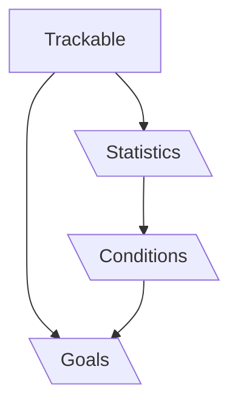
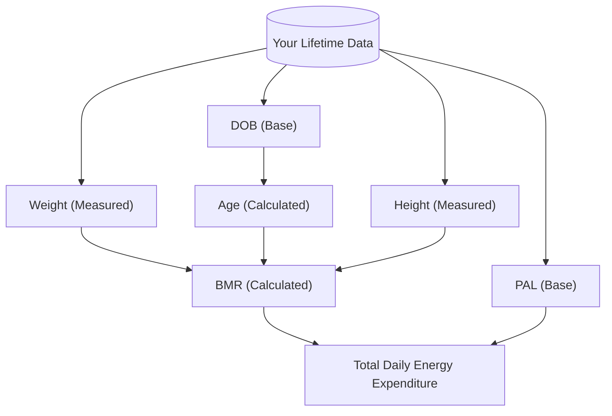

## Blocks are built from Trackables

Goals, statistics, plans are all built from our catalogue of trackables. The catalogue of trackables is engineered to be flexible and scalable, allowing you to select the trackable you want for your training block.

## Trackable Types

### Measured Trackables

Something that can be measured. Bodyweight, active calories, number of waves, your golf score..

Currently we support 297 measured trackables with over 60 usable units.

<Card
  horizontal
  title="Read more"
  icon="text"
  href="/pages/tools/trackables/measured-trackables"
>
  See the Measured Trackable catalogue
</Card>

### Calculated Trackables

Something that can be calculated. Total Energy Expenditure, Theoretical 1RM Bench, Your target run pace for a 5km Z2 run based on Einsteins formula..

<Card
  horizontal
  title="Read more"
  icon="text"
  href="/pages/tools/trackables/calculated-trackables"
>
  See the Calculated Trackable catalogue and what your calculations look like
</Card>

### Base Trackables

A raw fact about you that is not calculated nor measured. DOB, Gender, desired number of training sessions per week...

<Card
  horizontal
  title="Read more"
  icon="text"
  href="/pages/tools/trackables/base-trackables"
>
  See the Base Trackable catalogue
</Card>

## Unmatched Selection

### An end to end system

To provide an unmatched selection of trackables, Block Bear is able to reference build trackables from other trackables.

As a rule of thumb, if something has unit, it is either measured or calculated, and can be imported into your training blocks.

## On Demand Data Entry

For every calculation we first scan your previous data, and only ask if you to provide details if the root Base and Measured Trackable input don't exist.

This vastly reduces the data-entry required, enabling your swifty check your markers and data without entry every-time
